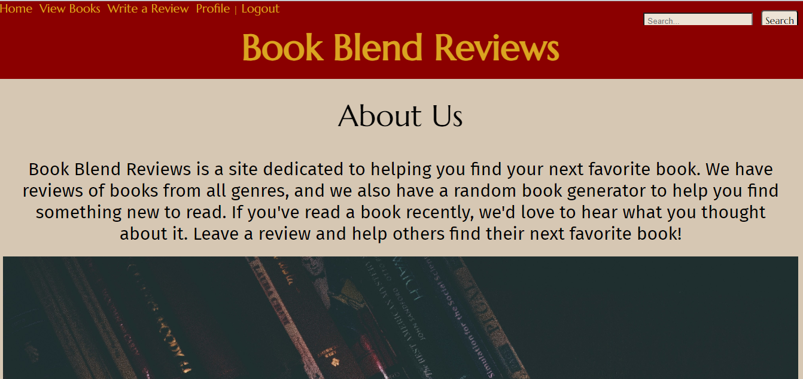
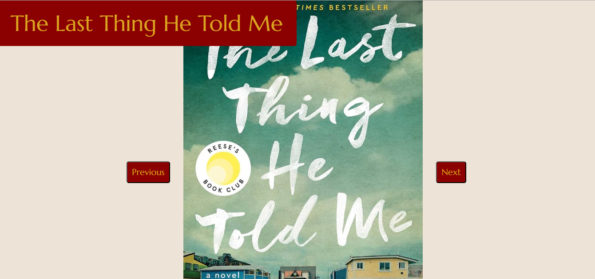

# Book Blend Reviews
We saw a need for an application that assists in selecting your next book while also providing access to reviews from fellow book enthusiasts, allowing users to both view and contribute reviews. Enjoy our site!

Here's what you'll see when you visit [Book Blend Reviews](https://book-blend-reviews-e430070779d0.herokuapp.com/)

## User Story
As a book lover, I want to be able to search for books by title, author, or genre so that I can find my next read. I also want to be able to read reviews from other users and contribute my own reviews.

## Technologies Used
  - bCrypt
  - Sequelize
  - Express
  - Handlebars
  - Fuse - Our new technology
  - MySQL
  - And a few others...see the package.json file for the full list

  ## Future Development
Our future for the site entails converting Book Blend Reviews into a social media platform. This transformation will enable users to follow and like reviews from friends, and even offer recommendations for their next reading choices.

  ## Collaborators
  [Noah Meister](https://github.com/njmeister) - Coding Wizard 🪄

  [Claire Shipley](https://github.com/cshipley98) - Research/Presentation Virtuoso ✨

  [Luke Pace](https://github.com/PacL00) - CSS Genius 🎓

  [Erin Sinclair](https://github.com/sinclairems) - Organization Oracle 🔮

  ## Credits

 * Class notes - especially the SQL, ORM, and MVC Modules

* [Fuse.js](https://www.fusejs.io/)

* [Generated User Data](https://randomuser.me/)

* Copilot

## License

This project is licensed under the MIT license.